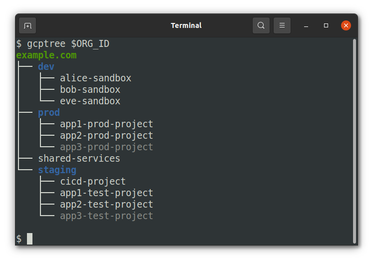

# gcptree

Like the unix `tree` command but for GCP Org Heirarchy.



For a note on coloring, the org node is green, folders and blue, and projects that are not `ACTIVE` are dimmed. These styles won't show up if you redirect output and Windows is supported by virtue of the `colorama` package.

# Installation

```
pip install gcptree
```

# Usage

```
$ gcptree --help
usage: gcptree [-h] [--format FORMAT] [--full-resource] org_id

Print out a GCP org heirarchy

positional arguments:
  org_id           GCP Organization ID

optional arguments:
  -h, --help       show this help message and exit
  --format FORMAT  Output format (json or text)
  --full-resource  API-parsable nodes where org and folder resource names are not resolved, i.e org/123 instead of example.com
```

## Permissions

The minimum role you'll need **at the organization level** is:

* `roles/browser'

The actual permissions needed (in case you want a custom role) are:

* `resourcemanager.projects.get`
* `resourcemanager.projects.list`
* `resourcemanager.folders.get`
* `resourcemanager.organizations.get`